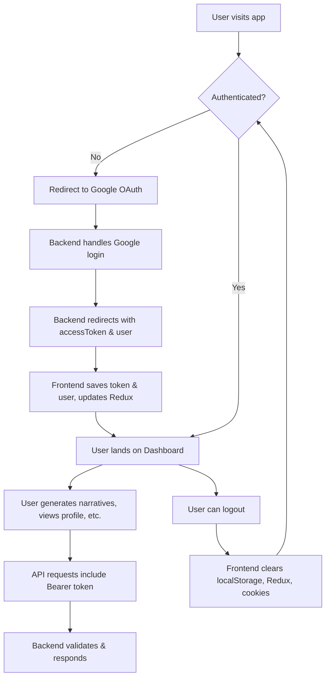

# NarrativeAI

A modern AI-powered narrative and brand story generator web application. Built with React, Redux Toolkit, TypeScript, Vite, and Tailwind CSS.

## 🚀 Live Demo

[Live App URL](https://varune-fe.vercel.app/)

---

## 🧩 Features
- Google OAuth authentication
- Secure JWT-based session management
- User profile and credits system
- AI-powered narrative generation (short & long form)
- Chat-based interface for narrative creation
- Persistent chat history
- Responsive, dark/light theme with Tailwind CSS
- Modern UI/UX

---

## 🛠️ Tech Stack
- **Frontend:** React, Redux Toolkit, TypeScript, Vite, Tailwind CSS
- **Backend:** Node.js, Express, MongoDB (not included in this repo)
- **Authentication:** Google OAuth 2.0, JWT
- **API Client:** Axios

---

## 🗂️ Project Structure
```
├── src/
│   ├── components/         # UI components (Dashboard, Auth, Profile, etc.)
│   ├── hooks/              # Custom React hooks
│   ├── services/           # API client logic
│   ├── store/              # Redux slices and store setup
│   ├── types/              # TypeScript types
│   ├── App.tsx             # Main app component
│   ├── main.tsx            # Entry point
│   └── index.css           # Tailwind CSS
├── public/
├── package.json
├── tailwind.config.js
├── vite.config.ts
└── ...
```

---

## 🔑 Environment Variables
Create a `.env` file in the root with the following:

```env
VITE_API_BASE_URL=http://localhost:3001/api
VITE_API_URL=http://localhost:3001
VITE_GOOGLE_CLIENT_ID=your-google-client-id
```

---

## 🧭 Workflow Diagram



---

## 🏁 Getting Started

1. **Clone the repo:**
   ```sh
   git clone https://github.com/your-username/narrativeai.git
   cd narrativeai
   ```
2. **Install dependencies:**
   ```sh
   npm install
   ```
3. **Set up your `.env` file** (see above)
4. **Run the app:**
   ```sh
   npm run dev
   ```
5. **Open in browser:**
   Visit [http://localhost:5173](http://localhost:5173)

---

## 📝 Credits & License
- Built by [Your Name](https://github.com/your-username)
- MIT License

---

## 📢 Notes
- Make sure your backend is running and CORS is configured to allow requests from your frontend URL.
- For Google OAuth, set the correct redirect URIs in your Google Cloud Console.
- This project is for educational/demo purposes. For production, review security best practices.
